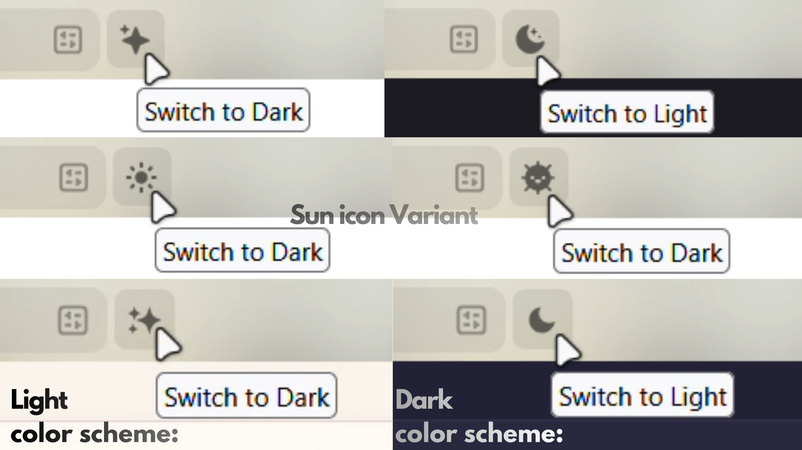

# Zen Site Appearance Toggle

A toolbar button for [Zen Browser](https://zen-browser.app/) & [Firefox](https://www.firefox.com) that toggles website dark/light mode with a single click using the built-in color-scheme preference in the browser settings — draggable anywhere in the toolbar like any native button.




**How it works:** It detects your system color scheme and gives you a two-state toggle between automatic and the opposite.

- **System is Light** → button shows ✨ sparkle → click forces Dark → button shows 🌙 moon → click resets to Auto (Light)
- **System is Dark** → button shows 🌙 moon → click forces Light → button shows ✨ sparkle → click resets to Auto (Dark)

The icon always reflects the current website color scheme, and clicking always switches to the opposite then back to auto.

---

## Preview

The button integrates natively into the Zen/Firefox toolbar — it respects hover states, sizing, and icon color automatically.

| State | Icon | Tooltip |
|-------|------|---------|
| Websites are dark (auto or forced) | 🌙 Moon | "Switch to Light" |
| Websites are light (auto or forced) | ✨ Sparkle | "Switch to Dark" |

The button can be placed anywhere: nav bar, sidebar, overflow menu — anywhere Firefox lets you drag toolbar items via **right-click → Customize Toolbar**.

---

## Requirements

- [Zen Browser](https://zen-browser.app/) or [Firefox](https://www.firefox.com)
- [fx-autoconfig](https://github.com/MrOtherGuy/fx-autoconfig) — lets Zen load `.uc.js` scripts (one-time setup, see below)

---

## Installation

### Step 1 — Install fx-autoconfig

fx-autoconfig is a small open-source loader by [@MrOtherGuy](https://github.com/MrOtherGuy) that lets Zen/Firefox run your own JavaScript at startup.

1. Go to [https://github.com/MrOtherGuy/fx-autoconfig](https://github.com/MrOtherGuy/fx-autoconfig)
2. Click **Code → Download ZIP** and extract it somewhere

**Copy files into Zen's install folder** (the folder where `zen.exe` / `zen` lives):

From the extracted ZIP, open the `program/` folder and copy both into your Zen install directory (e.g. `C:\Program Files\Zen Browser\` on Windows):
- `config.js`
- `defaults/` folder

> ⚠️ Windows may prompt for admin permission — click Yes.

> ⚠️ if you got a prompt that files already exist click Skip, you dont't have to replace it

**Copy files into your profile's chrome folder:**

Find your profile folder: go to `about:support` → *Profile Folder* → *Open Folder*. Inside it, open or create the `chrome/` folder.

From the extracted ZIP, open `profile/chrome/` and copy these three folders into your `chrome/` folder:
- `utils/`
- `JS/`
- `resources/`

Your `chrome/` folder should now look like:
```
chrome/
  ├── userChrome.css    ← yours (already exists or create it)
  ├── utils/            ← new (fx-autoconfig engine)
  ├── JS/               ← new (where scripts go)
  └── resources/        ← new
```

---

### Step 2 — Enable SVG context properties

In `about:config`, find and set to `true`:
```
svg.context-properties.content.enabled
```
This makes the button icon color automatically match your toolbar icons.

---

### Step 3 — Copy the toggle files

- [**`zen-colorscheme-toggle.uc.js`**](chrome/JS/zen-colorscheme-toggle.uc.js) → copy into `chrome/JS/`
- [**`userChrome.css`**](chrome/userChrome.css) → if you already have a `userChrome.css`, paste the contents at the end of your existing file. If you don't have one yet, copy it directly into `chrome/`.

---

### Step 4 — Clear startup cache & restart

1. Open Zen Browser
2. Go to `about:support`
3. Click **"Clear startup cache…"** (top-right corner)
4. Confirm — Zen restarts automatically

The toggle button will appear in your toolbar. To move it, right-click the toolbar → **Customize Toolbar** and drag it wherever you want.

---

## Uninstalling

- Delete `zen-colorscheme-toggle.uc.js` from `chrome/JS/`
- Remove the toggle CSS from your `userChrome.css`
- Clear startup cache once more

To fully remove fx-autoconfig: delete `config.js` and `defaults/` from Zen's install directory(if you didn't get a prompt that the files already exist), and delete `utils/`, `JS/`, and `resources/` from your `chrome/` folder.

---

## Troubleshooting

**Button not appearing** — Make sure the `.uc.js` is inside `chrome/JS/`, not directly in `chrome/`. Verify fx-autoconfig is installed correctly and that you cleared the startup cache.

**Icon invisible or wrong color** — Set `svg.context-properties.content.enabled` to `true` in `about:config`.

**CSS not applying** — Check that `zen.themes.disable-all` is not `true` in `about:config`.

---

## How it works (technical)

The script registers a proper Firefox toolbar widget using `UC_API.Utils.createWidget()` from fx-autoconfig, which is what allows it to be dragged to any toolbar position and appear in the Customize menu.

The icon is set as a data URI SVG on the button's existing `<image class="toolbarbutton-icon">` element, using `context-fill` so it inherits the toolbar icon color automatically. No extra DOM elements are added — hover, sizing, and alignment are handled natively by the toolbarbutton.

On each click, it reads `window.matchMedia("(prefers-color-scheme: dark)")` to detect your system preference, then writes to `layout.css.prefers-color-scheme.content-override`:

| Value | Effect |
|-------|--------|
| `3` | Automatic (follows system/browser theme) |
| `0` | Force Dark on all websites |
| `1` | Force Light on all websites |

This is the same preference Zen's *Settings → General → Website Appearance* controls.
